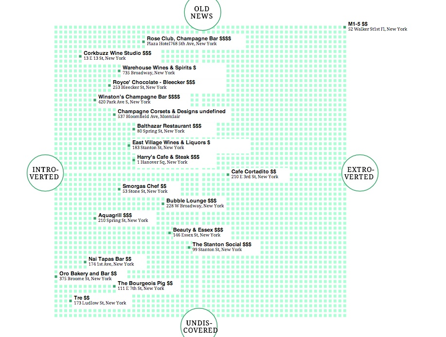

yelpquadrant
============

Sure, you're looking for a particular type of food in a particular area, but what you really want is a *vibe*. We wanted to plot data about the way restaurants feel. 

#####What is does

Accepting all Yelp-viable queries, this plots the top 20 results on two axes: Introverted/Extroverted and Old News/Undiscovered. 

#####How it works

This is an Express web app that takes a search query from the user, passes it to the Yelp API and scrapes information from the Yelp reviews to find keywords that place the resulting Javascript objects into the coordinate plane, with links to the Yelp pages if users want more information. Uses d3.js to generate the graph.

